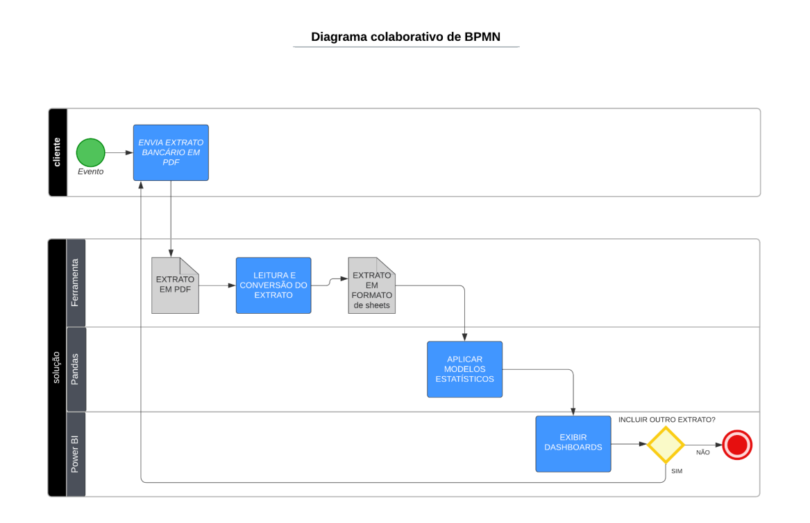

  

### UNIVERSIDADE FEDERAL DA PARAÍBA

### CAMPUS IV – CENTRO DE CIÊNCIAS APLICADAS E EDUCAÇÃO – RIO TINTO/PB

**Curso:** Licenciatura em Ciências da Computação – LCC

**Curso:** Bacharelado em Sistemas de Informação - BSI

**Componente Curricular:** Engenharia de Software – 8103151

**Prof.:** Luiz Sérgio Plácido da Silva
#
**Alunos:**

Mateus Neres Da Silva

Valeria Joyse Santos Nunes

John Wesley Da Silva Moreira Pinto

Gabriel dos Santos Lopes

Erick Fernandes De Farias Santos

#

Rio Tinto
 2024

#

# **Projeto de Engenharia de Software - Análise de Extratos Bancários**

# **VISÃO DE NEGÓCIO**

## Finalidade

Este documento tem o propósito de fornecer uma visão global acerca da solução a ser adotada na aplicação.

## Descrição do Negócio
Este projeto foi desenvolvido para a disciplina de Engenharia de Software na Universidade Federal da Paraíba. O objetivo da solução é criar uma ferramenta que leia extratos bancários mensais, fornecendo relatórios detalhados através de dashboards interativos dos rendimentos e despesas utilizando como entrada extratos bancários de qualquer instituição, mas com o padrão de formato PDF.

## Atividades e Processos de Negócio

## Oportunidade de Negócios
Considerando o desafio de integração entre os dados do fluxo bancários em diferentes de instituições financeiras, a pluralidade e maneiras particulares de expor os extratos bancários ao cliente, a nossa aplicação visa estabelecer um canal de análise base, para mesclar e fornecer as principais interações estatísticas através dashboards interativos independente da quantidade extratos bancários fornecidos e de sua instituição de origem.

## Funcionalidades

- Leitura de extratos bancários em diversos formatos (PDF).
- Extração de dados relevantes como despesas, receitas, saldos e categorias de gastos.
- Geração de relatórios detalhados sobre despesas e rendimentos.
- Criação de dashboards interativos para visualização e análise dos dados financeiros.

## Tecnologias Utilizadas

- **Linguagem de Programação**: Python

- **Bibliotecas**: Pandas, Matplotlib, Seaborn, Plotly, Dash, loguru, openpyxl, os, tabula, PyPDF2

## Estrutura do Projeto

    PROJETO-ESW
        |
        |
        ├── modulo
        |   |
        |   |
        │   ├── modulo.py - Código principal do projeto.
        |   |
        │   ├── lib_ESW.py - Arquivo contendo funções utilizadas no projeto.
        |   |
        │   ├── extrato.pdf - Base de dados.
        |   |
        │   ├── extrato.xlsx - Relatórios extraido do pdf para tratamento.
        |   |
        │   ├── ExtratoLimpo.xlsx - Relatório para entrega ao cliente e conecção com o Power BI.
        |   |
        │   ├── logfile.txt - Arquivos Logs para análise de funcionamento do sistema.
        |   |
        │   ├── DashBoard - Dashboards criados para visualização - integração com power BI. 
        |        
        |
        ├── teste
        |   |
        |   |
        |   ├── relatorio_de_teste
        |   |   |
        |   |   |
        |   |   ├── coverage_html_cb_6fb7b396.js - exibir o relatório HTML de cobertura de código.
        |   |   |
        |   |   ├── favicon_32_cb_58284776.png - O ícone favicon exibido na aba do navegador quando você abre o relatório HTML.
        |   |   |
        |   |   ├── index.html - Exibi os resultados da cobertura de teste do seu código
        |   |   |
        |   |   ├── keybd_closed_cb_ce680311.png - Imagem auxiliar utilizada no relatório.
        |   |   |
        |   |   ├── lib_ESW_py.html - exibe as linhas de código e destaca quais partes foram ou não cobertas pelos testes
        |   |   |
        |   |   ├── status.json - contém informações sobre a cobertura de teste em formato estruturado.
        |   |   |
        |   |   ├── style_cb_8e611ae1.css - controla a aparência das páginas, como cores, fontes, e layout.
        |   |   |
        |   |   ├── test_lib_py.html - exibe as linhas de código e destaca quais partes foram ou não cobertas pelos testes
        |   |   
        |   |
        │   ├── lib_ESW.py - Base funções para teste unitarios.
        |   |
        │   ├── test_lib.py - Modelos de teste.
        |   |
        │   ├── test.pdf - Base de Dados para teste.
        |
        |   
        ├── README.md - Documentação do "Projeto de Engenharia de Software - Análise de Extratos Bancários"
        | 
        ├── .gitignore - Controle de arquvos compartilhados com o repositório remoto.
        |
        ├── diagrama.png - Diagram de Ciclo de Vida do Projeto de Engenharia de Software - Análise de Extratos Bancários
        |
        ├── entregas_proj_ESW.txt - Controle de Entrega do Projeto de Engenharia de Software - Análise de Extratos Bancários
        |
        ├── LICENSE - Licença de uso do GitHub
        |
        ├── power-bi-connect-data.pdf - Documentação de conecção do sistema Análise de Extratos Bancários com o Power BI
        |
        ├── logfile.txt - Arquivos Logs para análise de funcionamento do teste unitario do sistema.
        |
        ├── ufpb_logo.png - Logo da Universidade Federal da Paraíba

# 

# **CICLO DE VIDA DO PROJETO**

## Planejamento e Definição de Requisitos

### Objetivo:

- Entender as necessidades dos usuários e definir os requisitos funcionais e não funcionais do sistema.

### Atividades:

- Reuniões para levantar requisitos.
- Definição das funcionalidades principais (leitura de extratos, geração de relatórios, criação de dashboards).
- Estabelecimento de prazos e cronograma do projeto.

### Resultados:

- Documento de Requisitos do Software (DRS).
- Especificação das funcionalidades e tecnologias a serem usadas.

## Design do projeto

### Objetivo:

- Arquitetar a solução e definir a estrutura do código e da aplicação.

### Atividades:

- Design da arquitetura do sistema.
- Definição da estrutura de pastas e módulos.
- Escolha de bibliotecas e ferramentas.

### Resultados:

- Diagrama de arquitetura do sistema.
- Estrutura inicial do projeto (como a organização das pastas e arquivos).

## Desenvolvimento

### Objetivo: 

- Implementar as funcionalidades definidas nos requisitos.

### Atividades:

**Codificação das funcionalidades principais:**

- Módulo de leitura de extratos bancários.
- Funções para extração e análise de dados.
- Geração de relatórios.
- Criação de dashboards.
- Integração de bibliotecas externas.

### Resultados:

- Módulos de código prontos (modulo.py e lib_ESW.py).
- Funcionalidades implementadas e testadas de forma individual.

## Testes

### Objetivo: 

- Garantir que o sistema funciona conforme o esperado e sem erros.

### Atividades:

- Testes unitários das funções.
- Testes de integração para garantir que os módulos funcionam juntos.
- Testes de sistema para verificar a funcionalidade completa.

### Resultados:

- Relatórios de testes.
- Correções de bugs identificados.

## Implantação

### Objetivo: 

- Disponibilizar o sistema para os usuários finais.

### Atividades:

- Preparação do ambiente de execução (Jupyter Notebook, instalação de bibliotecas).
- Entrega do projeto para avaliação ou uso.

### Resultados:

- Sistema pronto para uso ou avaliação.
- Documentação do projeto final.

## Manutenção

### Objetivo: 

- Garantir a longevidade do sistema e fazer melhorias contínuas.

### Atividades:

- Correções de bugs após a entrega.
- Atualizações de funcionalidades com base em feedbacks.
- Adição de novas funcionalidades (opcional).

### Resultados:

- Versões atualizadas do sistema.

#

# **PROCESSO DE DESENVOLVIMENTO**

## Metodologia de Desenvolvimento

- Começar com uma iteração curta para implementar as funcionalidades básicas, como a leitura de extratos e extração de dados.
- Focar em um protótipo funcional que permita a leitura de diferentes formatos de arquivos e a geração de relatórios simples.
- Adicionar novas funcionalidades em cada iteração:
- Implementação de relatórios mais detalhados.
- Desenvolvimento de dashboards interativos.
- Cada iteração deve incluir a fase de testes e integração dos novos módulos com os existentes.

## Revisões e Feedbacks

- Realizar revisões periódicas com o professor ou colegas para obter feedback sobre o progresso.
- Ajustar o desenvolvimento conforme o feedback recebido para garantir que o sistema atenda às expectativas.

## Entrega Final

- Consolidar todas as funcionalidades desenvolvidas.
- Realizar testes finais e preparar a documentação do projeto.
- Entregar o projeto dentro do prazo estabelecido.

#

# **DOCUMENTAÇÃO DE REQUISITOS DE SOFTWARE (SRS)**

 ## Introdução

 Este documento descreve os requisitos funcionais e não funcionais para o sistema de leitura e processamento de arquivos PDF, extração e categorização de dados financeiros, e geração de relatórios e dashboards interativos.

 ### Prioridade dos Requisitos

A cada requisito será atribuída uma prioridade. A descrição de cada uma segueabaixo:**

 - Essencial: é um requisito imprescindível. Sem ele, o sistema não funcionará.
 - Importante: é um requisito que deve ser implementado, mas, se não for, o sistema funcionará do mesmo jeito, mas de maneira insatisfatória.
 - Desejável: é um requisito que trará um diferencial adicional ao sistema. Por isso, pode ser deixado para ser implementado por último ou em próximas iterações.

 ## Requisitos Funcionais

            +-----------------------------------------------------------+
            | 1. Leitura e Extração de Arquivos PDF                     |
            +-----------------------------------------------------------+
                          |                                   |                       
            +-----------[RF001]-----------+   +-------------[RF002]-------------+
            |   Suporte a arquivos PDF    |   |   Lidar com diferentes versões  |
            |   com texto, tabelas e      |   |   e codificações de PDF.        |
            |   imagens.                  |   |                                 |
            +-----------------------------+   +---------------------------------+
                            |       
            +--------------------------------------------------------------+
            |   Critério: Capacidade de extrair texto de 95% dos arquivos  |
            |   e relatar falhas ao tentar ler PDFs não suportados.        |
            +--------------------------------------------------------------+
#
            +-----------------------------------------------------------+
            | 2. Extração e Categorização de Dados Financeiros          |
            +-----------------------------------------------------------+
                          |                                   |                       
            +-----------[RF003]-----------+   +-------------[RF004]-------------+
            |   Extração de dados como    |   |   Categorização dos dados de    |
            |   receitas, despesas, lucros|   |   acordo com categorias         |
            |   e outros indicadores.     |   |   financeiras específicas.      |
            +-----------------------------+   +---------------------------------+
                            |       
            +--------------------------------------------------------------+
            |   Critério: Extração de 98% dos dados financeiros e          |
            |   alinhamento com categorias predefinidas.                   |
            +--------------------------------------------------------------+
#
            +-----------------------------------------------------------+
            | 3. Geração de Relatórios Financeiros Detalhados           |
            +-----------------------------------------------------------+
                          |                                   |                       
            +-----------[RF005]-----------+   +-------------[RF006]-------------+
            |   Relatórios com gráficos,  |   |   Exportação de relatórios      |
            |   tabelas e análises        |   |   para PDF, Excel, etc.         |
            |   detalhadas.               |   |                                 |
            +-----------------------------+   +---------------------------------+
                            |       
            +--------------------------------------------------------------+
            |   Critério: Relatórios gerados com precisão e formatos       |
            |   corretamente exportados sem perda de dados.                |
            +--------------------------------------------------------------+
#
            +-----------------------------------------------------------+
            | 4. Criação de Dashboards Interativos                      |
            +-----------------------------------------------------------+
                          |                                   |                       
            +-----------[RF007]-----------+   +-------------[RF008]-------------+
            |   Dashboards com gráficos   |   |   Atualização automática dos    |
            |   interativos, filtros e    |   |   dashboards com novos dados.   |
            |   drill-down.               |   |                                 |
            +-----------------------------+   +---------------------------------+
                            |       
            +--------------------------------------------------------------+
            |   Critério: Dashboards responsivos, interativos e atualizados|
            |   com dados precisos.                                        |
            +--------------------------------------------------------------+
#

 ## Requisitos Não Funcionais

            +---------------------------------------------------------+     
            | 1. Desempenho na Leitura e Processamento de Arquivos PDF|
            +---------------------------------------------------------+
                          |                                   |                       
            +-----------[NF001]-----------+   +-------------[NF002]-------------+
            |   O sistema deve suportar   |   |   Eficiência sem especificação  |
            | a leitura e processamento   |   | de tempo ou tamanho.            |
            | simultâneo de múltiplos     |   |                                 |
            | arquivos PDF.               |   |                                 |
            +-----------------------------+   +---------------------------------+
                            |       
            +---------------------------------+
            |   Critério: Desempenho          |
            | consistente sob carga elevada.  |
            +---------------------------------+
#
            +-----------------------------------------------------------+
            | 2. Interface Intuitiva para Relatórios e Dashboards       |
            +-----------------------------------------------------------+
                          |                                   |                       
            +-----------[NF003]-----------+   +-------------[NF004]-------------+
            |   A interface deve ser      |   |   Funcionalidades principais    |
            | fácil de usar e navegar.    |   | acessíveis em no máximo três    |
            |                             |   | cliques.                        |
            +-----------------------------+   +---------------------------------+
                          |                                  |
      +------------------------------------+   +------------------------------------+
      |   Critério: Geração e visualização |   |   Critério: Alta satisfação dos    |
      | de relatórios com facilidade.      |   | usuários com a interface.          |
      +------------------------------------+   +------------------------------------+
  #

            +---------------------------------------------------------------+
            | 3. Compatibilidade com Ferramentas de Visualização de Dados   |
            +---------------------------------------------------------------+
                          |                                    |
            +-----------[NF005]-----------+   +-------------[NF006]-------------+
            |   Exportação compatível     |   |   Integração ou exportação      |
            | com Power BI, Looker Studio.|   | direta sem erros significativos.|
            |                             |   |                                 |
            +-----------------------------+   +---------------------------------+
                          |                                  |
      +------------------------------------+   +------------------------------------+
      |   Critério: Dados corretamente     |   |   Critério: Funcionamento sem      |
      | importados nas ferramentas.        |   | erros significativos.              |
      +------------------------------------+   +------------------------------------+
  #

 # **PLANEJAMENTO DE TESTES**

              +-------------------------+
              |  Planejamento de Testes |
              +-------------------------+
                          |
                +----------+----------+
                |                     |
            +--v--+         +--------v--+----+      
            |Fluxo|         |Tecnologia Usada|
            +-----+         +----------------+
              |                      |
              v                      v
      +----------------+      +--------------------------+
      | Identificar    |      | Ferramenta de Automação  |
      | Requisitos     |      | de Testes                |
      +----------------+      +--------------------------+
                |                       |
        +-------v----------+   +--------------------+
        | Definir Critérios|   | Framework de Teste:|
        | de Aceitação     |   | unittest           |
        +------------------+   +--------------------+
                |                 |
        +-------v-------+     +---------------------+
        | Criar Casos   |     | Sistema de Controle |
        | de Teste      |     | de Versão: GitHub   |
        +---------------+     +---------------------+
                |             
        +-------v--------+     
        | Executar Testes|     
        +----------------+    
                |             
        +-------v-------+
        | Registrar     |
        | Resultados    |
        +---------------+
               |
        +------v---------+
        |   Resultados   |
        +----------------+
               |
        +------v----------------------------+
        | Resultados Esperados vs Reais     |
        +-----------------------------------+
               |
        +------v----------------------------+
        | Registro de Defeitos              |
        +-----------------------------------+
               |
        +------v----------------------------+
        | Relatório de Execução de Testes   |
        +-----------------------------------+

[Click aqui para ver o relatório de Testes 📊](http://127.0.0.1:5500/teste/relatorio_de_teste/index.html)

[Click aqui para ver o modelo de testes 💻](https://github.com/mateus-neres/projeto-ESW/blob/main/test/test_lib.py) 

[Click aqui para ver a base de teste 📋](https://github.com/mateus-neres/projeto-ESW/blob/main/test/lib_ESW.py)

[Click aqui para ver o logs de testes 📄](https://github.com/mateus-neres/projeto-ESW/blob/main/logfile.txt)

#

# **INTERFACE COM POWER BI**
[Click aqui para abrir o DashBoard](https://app.powerbi.com/view?r=eyJrIjoiYTM0ODdlN2UtNzgwMC00NjA2LWEzY2UtZmI0YmRiNWI4OTM2IiwidCI6ImJmN2UwZjYwLTVhMjktNDk4Ny1iNzA5LWYxYWIyODhmNjM4NSJ9)
## Conectar-se a dados no Power BI – documentação

A documentação do Power BI fornece informações de especialistas para conectar-se a dados com ferramentas como gateways aplicativos de modelo e atualização de dados.

[Conectar-se a dados no Power BI – documentação](https://github.com/mateus-neres/projeto-ESW/blob/main/power-bi-connect-data.pdf)
#

